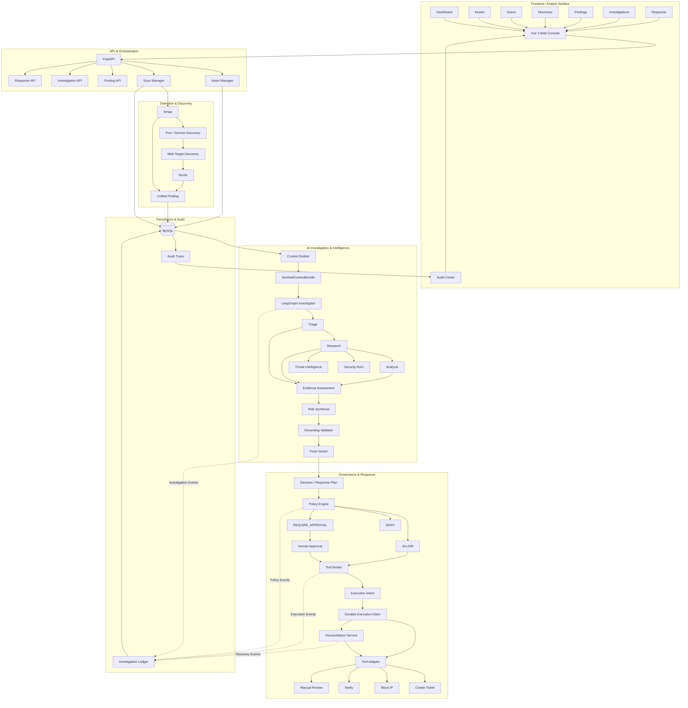

# SentinelAgent

> **AI-Powered Security Operations Agent**
>
> 从自动化安全发现，到证据驱动的 AI 调查，再到策略约束下的安全响应与审计。

[](https://www.python.org/)
[](https://fastapi.tiangolo.com/)
[](https://vuejs.org/)
[](https://www.langchain.com/langgraph)
[](#project-status)
[](#security--authorized-use)

---

## What is SentinelAgent?

# SentinelAgent

> **AI-Powered Security Operations Agent**

SentinelAgent 是一个面向安全运营场景设计的 AI Security Agent。

它将 Nmap / Nuclei 等安全扫描结果转化为结构化安全上下文，
通过 LangGraph 驱动多阶段、证据约束的 AI 调查，
并利用 Policy Engine、Human Approval 与具备幂等和崩溃恢复能力的
Tool Broker 实现受控安全响应与完整审计。

> SentinelAgent transforms raw security findings into structured investigation context,
> performs evidence-grounded multi-stage AI investigation,
> and executes response actions through policy-governed,
> auditable, and crash-safe tooling.

---

# Quick Start

SentinelAgent `v1.0-demo` 当前主要面向：

- 本地开发与测试
- Defensive Security Research
- AI Security Engineering
- Authorized Vulnerability Assessment
- Security Automation Experiments

> [!WARNING]
> SentinelAgent 包含主动安全扫描能力。  
> **仅可扫描你拥有或已获得明确授权的系统。**

---

## Prerequisites

建议准备以下环境：

| Dependency | Purpose |
| --- | --- |
| Python 3.12+ | FastAPI Backend / Agent Workflow |
| Node.js + npm | Vue 3 Frontend |
| MySQL | Asset / Scan / Finding / Audit Persistence |
| Ollama | Local LLM Inference |
| Nmap | Port & Service Discovery |
| Nuclei | Template-based Security Scanning |
| Nuclei Templates | Nuclei Detection Rules |

还需要：

- 至少一个可用的本地 LLM
- 一个 Embedding Model
- 可用的 Nuclei Templates

模型可根据本地硬件环境调整。

---

## 1. Clone

```bash
git clone https://github.com/Ti-hub668/SentinelAgent.git
cd SentinelAgent
```

---

## 2. Backend Setup

进入后端：

```powershell
cd backend
```

创建虚拟环境：

```powershell
python -m venv .venv
```

激活：

```powershell
.\.venv\Scripts\Activate.ps1
```

安装依赖：

```powershell
pip install -r requirements.txt
```

复制环境配置：

```powershell
Copy-Item .env.example .env
```

然后根据本机环境编辑：

```text
backend/.env
```

配置：

- MySQL
- Ollama / LLM
- Embedding Model
- Nmap / Nuclei
- Nuclei Templates
- 可选外部集成

> [!IMPORTANT]
> 不要把真实密码、API Key、GitHub Token 或其他 Secret 提交到 Git。

---

## 3. Prepare MySQL

确保 MySQL 已启动，并创建 `.env` 中配置的数据库。

然后运行 Schema Migration：

```powershell
python -m scripts.migrate_schema
```

Migration 支持重复执行。

---

## 4. Prepare Ollama

确认 Ollama 正常运行：

```powershell
ollama list
```

确保 `.env` 中使用的：

- LLM Model
- Embedding Model

已经安装。

例如可以根据自己的硬件环境选择合适模型。

---

## 5. Prepare Nmap & Nuclei

确认 Nmap：

```powershell
nmap --version
```

确认 Nuclei：

```powershell
nuclei -version
```

同时确保配置的 Nuclei Templates 路径存在。

---

## 6. Frontend Setup

进入前端：

```powershell
cd ..\frontend
```

安装依赖：

```powershell
npm install
```

---

## 7. One-command Start

完成首次环境准备后，返回项目根目录：

```powershell
cd ..
```

运行：

```powershell
.\start-dev.ps1
```

启动脚本会检查并启动 SentinelAgent 本地开发环境。

默认地址：

| Service | URL |
| --- | --- |
| SentinelAgent UI | `http://127.0.0.1:5173` |
| FastAPI Backend | `http://127.0.0.1:18080` |
| Swagger / OpenAPI | `http://127.0.0.1:18080/docs` |

以后日常启动通常只需要：

```powershell
.\start-dev.ps1
```

如果 PowerShell 阻止本地脚本执行，可以仅为当前终端临时允许：

```powershell
Set-ExecutionPolicy -Scope Process -ExecutionPolicy Bypass
```

然后重新执行：

```powershell
.\start-dev.ps1
```

---

# First Demo

推荐按照下面的顺序体验 SentinelAgent。

### 1. Assets

登记一个你有权测试的资产。

```text
Assets
   ↓
Register Target
```

### 2. Scans

创建扫描任务：

```text
Asset
  ↓
Nmap
  ↓
Port / Service Discovery
  ↓
Web Target Discovery
  ↓
Nuclei
```

### 3. Discovery

查看：

- Host
- Open Port
- Protocol
- Service
- Product
- Version
- Web Target
- Scan Status
- Discovery Time

Discovery Inventory 是已有扫描结果的只读库存。

读取 Discovery **不会重新执行 Nmap 或 Nuclei**。

### 4. Findings

查看扫描结果归一化后的安全 Finding。

### 5. Investigations

从 Finding 发起 AI Investigation：

```text
Finding
   ↓
Context Builder
   ↓
SentinelContextBundle
   ↓
LangGraph Investigator
```

### 6. AI Investigation

调查过程经过：

```text
Triage
   ↓
Research
   ├── Security RAG
   └── Threat Intelligence
   ↓
Analysis
   ↓
Evidence Assessment
   ↓
Risk Synthesis
   ↓
Grounding Validator
   ↓
Final Verdict
```

### 7. Response

最终结论进入：

```text
Response Plan
     ↓
Policy Engine
     ↓
ALLOW
DENY
REQUIRE_APPROVAL
```

高风险操作可要求人工审批。

### 8. Tool Execution

批准后的动作进入：

```text
Tool Broker
    ↓
Execution Intent
    ↓
Durable Claim
    ↓
Tool Adapter
    ↓
External System
```

### 9. Audit

最后进入 Audit Center 查看：

- Investigation Events
- Evidence
- Policy Decision
- Approval
- Tool Execution
- Replay
- Reconciliation
- Failure / Recovery

更完整的演示流程：

[`docs/DEMO.md`](docs/DEMO.md)

---

# Architecture

SentinelAgent 可以看作六个主要层次：



---

# Core Workflow

一次完整的安全调查可以概括为：

```text
Asset
  ↓
Scan
  ↓
Nmap
  ↓
Port / Service Discovery
  ↓
Web Target Discovery
  ↓
Nuclei
  ↓
Unified Finding
  ↓
MySQL
  ↓
Context Builder
  ↓
SentinelContextBundle
  ↓
LangGraph Investigator
  ↓
Triage
  ↓
Research
 ├── RAG
 └── Threat Intelligence
  ↓
Analysis
  ↓
Evidence Assessment
  ↓
Risk Synthesis
  ↓
Grounding Validator
  ↓
Final Verdict
  ↓
Response Plan
  ↓
Policy Engine
  ↓
ALLOW / DENY / REQUIRE_APPROVAL
  ↓
Human Approval
  ↓
Tool Broker
  ↓
Controlled Execution
  ↓
Idempotency / Replay / Reconciliation
  ↓
Investigation Ledger
  ↓
Audit Trace
```

---

# Why SentinelAgent?

很多 AI + Security Demo 的核心链路是：

```text
Scanner Result
      ↓
Prompt
      ↓
LLM
      ↓
Security Report
```

这种方式很容易遇到几个问题：

- Scanner 输出格式彼此不同；
- 扫描事实和模型推理混在一起；
- RAG 检索结果可能被模型当成事实；
- LLM 的建议可能直接变成外部执行；
- 重试可能重复创建 Ticket / Notification；
- 外部动作成功后如果服务崩溃，本地可能不知道；
- 整个调查过程难以解释和审计。

SentinelAgent 针对这些问题,将安全运营流程重新组织为：

```text
Detect
  ↓
Normalize
  ↓
Investigate
  ↓
Retrieve
  ↓
Ground
  ↓
Decide
  ↓
Govern
  ↓
Approve
  ↓
Execute
  ↓
Recover
  ↓
Audit
```
对应到系统内部，则是：

Nmap / Nuclei
      ↓
Unified Finding
      ↓
Context Builder
      ↓
SentinelContextBundle
      ↓
LangGraph Investigator
      ↓
Triage
      ↓
Research
 ├── Security RAG
 └── Threat Intelligence
      ↓
Analysis
      ↓
Evidence Assessment
      ↓
Risk Synthesis
      ↓
Grounding Validator
      ↓
Final Verdict
      ↓
Response Plan
      ↓
Policy Engine
      ↓
ALLOW / DENY / REQUIRE_APPROVAL
      ↓
Human Approval
      ↓
Tool Broker
      ↓
Idempotent / Controlled Execution
      ↓
Crash Recovery / Reconciliation
      ↓
Investigation Ledger / Audit Trace

SentinelAgent 的目标不是简单地产生一份 AI 安全报告，而是构建一条：
从检测、调查、证据约束、风险决策，到策略治理、受控执行和审计恢复的完整安全运营 Agent Workflow。
---

## 1. Unified Finding

不同 Scanner 的输出首先转化为统一 Finding：

```text
source
finding_type
title
severity
target
description
evidence
remediation
status
risk_score
risk_level
risk_reason
```

后续 Agent Workflow 不再依赖具体 Scanner 的原始格式。

---

## 2. Structured Security Context

SentinelAgent 不直接执行：

```text
Finding
   ↓
Prompt
   ↓
LLM
```

而是：

```text
Finding
   ↓
Context Builder
   ↓
SentinelContextBundle
   ↓
Investigator
```

Context 可以组织：

- Asset Context
- Scanner Evidence
- Finding Information
- Research Results
- RAG Knowledge
- Threat Intelligence
- Investigation History

---

## 3. Multi-stage LangGraph Investigation

调查不是一次 Prompt，而是多个职责明确的阶段：

```text
Triage
   ↓
Research
   ↓
Analysis
   ↓
Evidence Assessment
   ↓
Risk Synthesis
   ↓
Grounding Validator
   ↓
Final Verdict
```

这样更容易：

- 调试
- 扩展
- 评测
- 追踪
- 审计

---

## 4. RAG + Threat Intelligence

Research 阶段可以组合两类外部信息：

```text
Security RAG
     ↓
Internal / Vertical Security Knowledge
```

以及：

```text
Threat Intelligence
        ↓
External Security Intelligence
```

它们提供调查上下文，但不会直接成为最终 Verdict。

---

## 5. Evidence Grounding

SentinelAgent 尽量区分：

```text
Evidence
```

和：

```text
Model Reasoning
```

最终结论需要经过：

```text
Evidence Assessment
        ↓
Risk Synthesis
        ↓
Grounding Validation
        ↓
Final Verdict
```

目标是降低：

- hallucination
- unsupported claims
- evidence mismatch

对安全结论的影响。

---

## 6. AI Does Not Equal Authorization

SentinelAgent 不允许 LLM 自由决定外部工具执行。

```text
LLM Recommendation
       ↓
Response Plan
       ↓
Policy Engine
```

Policy Engine 输出：

```text
ALLOW
DENY
REQUIRE_APPROVAL
```

因此：

```text
Reasoning
    ≠
Authorization
    ≠
Execution
```

---

## 7. Human-in-the-loop

对于需要人工确认的动作：

```text
REQUIRE_APPROVAL
        ↓
Human Approval
        ↓
Approved / Rejected
```

只有满足策略要求的动作才可以进入 Tool Broker。

---

## 8. Governed Tool Broker

Tool Broker 统一管理安全动作：

```text
Authorization
     ↓
Parameter Validation
     ↓
Execution Intent
     ↓
Durable Claim
     ↓
Adapter Invocation
     ↓
Execution Result
     ↓
Ledger Record
```

当前 Adapter 体系包括：

- Create Ticket
- Block IP
- Notify
- Manual Review

真实外部执行默认受到配置和 Policy 约束。

---

# Safe External Execution

AI Agent 一旦执行具有副作用的操作，就会遇到一个重要问题：

```text
Agent
  ↓
Create External Ticket
  ↓
External System Succeeds
  ↓
Backend Crashes
  ↓
Local State Not Saved
```

如果恢复后直接 retry：

```text
Retry
  ↓
Create Another Ticket
```

就可能产生重复副作用。

因此 SentinelAgent 实现了：

- Execution Intent
- Request Fingerprint
- Idempotency Key
- Execution ID
- Durable Execution Claim
- Replay
- Duplicate Suppression
- Reconciliation

---

## Durable Execution Claim

在外部执行之前，系统首先持久化执行身份：

```text
run_id
request_index
tool_name
idempotency_key
request_fingerprint
execution_id
status
attempt
owner_token
receipt
output
```

这样即使进程崩溃，执行上下文仍然存在。

---

## Idempotency & Replay

对于已经完成的相同请求：

```text
Same Request
     ↓
Completed Claim Exists
     ↓
Replay Stored Result
```

而不是再次调用外部系统。

---

## Crash Recovery & Reconciliation

对于结果未知的外部执行：

```text
Execution Claim
      ↓
External Execution
      ↓
Backend Crash
      ↓
Claim Remains Claimed
      ↓
Claim Becomes Stale
      ↓
Reconciliation
      ↓
Verify External State
```

Reconciliation 使用：

```text
adapter.reconcile()
```

而不是：

```text
adapter.execute()
```

核心原则：

> **not_found != not_executed**

“没有找到外部记录”并不能证明“之前一定没有执行”。

因此未知状态默认采用更保守的恢复方式，而不是直接重新执行危险动作。

---

# Investigation Ledger & Audit

SentinelAgent 会记录关键 Agent 行为：

```text
Investigation Events
Policy Events
Approval Events
Tool Execution Events
Reconciliation Events
Failure Events
```

典型事件包含：

```text
run_id
event_type
node_name
status
summary
event_metadata
created_at
```

Audit Center 用于回答：

```text
What happened?

Why did the Agent make this decision?

What evidence supported it?

Which node produced the result?

Was execution allowed?

Was human approval required?

Was the tool actually invoked?

Was the result replayed?

Did reconciliation recover the execution?
```

这使 Agent Workflow 不只是“得到答案”，也能够被追踪和审计。

---

# Asset & Service Discovery

SentinelAgent 使用：

```text
Nmap
  ↓
Port / Service Discovery
  ↓
Web Target Discovery
  ↓
Nuclei
```

Discovery Inventory 通过只读 API：

```text
GET /api/scans/discovery
```

展示已有扫描发现。

字段包括：

```text
asset_id
scan_task_id
host
protocol
port
service
product
version
web_target
scan_status
discovered_at
```

相同：

```text
asset_id + host + protocol + port
```

保留最近一次观察。

> Discovery 是历史安全观察库存。  
> 某端口曾被发现开放，不代表它此刻仍然开放。

---

# Evaluation

SentinelAgent 不只实现 Agent Workflow，还为多个模块提供 Evaluation。

目前包括：

```text
Prompt Evaluation
Dataset Validation
RAG Evaluation
RAG Top-K Ablation
Context Builder Evaluation
Discovery Inventory Evaluation
Tool Registry Evaluation
Tool Capability Evaluation
Tool Adapter Evaluation
Tool Broker Evaluation
Broker Integration Evaluation
Real-mode Execution Guard
Execution Idempotency Evaluation
Execution Claim Evaluation
Claim Staleness Evaluation
Ticket Reconciliation Evaluation
Reconciliation Service Evaluation
```

示例：

```powershell
cd backend

python -m app.evaluation.discovery_inventory_evaluator
python -m app.evaluation.context_builder_evaluator
python -m app.evaluation.reconciliation_service_evaluator
python -m app.evaluation.execution_claim_evaluator
python -m app.evaluation.claim_staleness_evaluator
python -m app.evaluation.execution_idempotency_evaluator
python -m app.evaluation.tool_broker_evaluator
```

项目还包含 RAG Top-K Ablation，用于比较不同检索配置对安全分析结果的影响。

Evaluation 的目标是让：

```text
Prompt
RAG
Agent Workflow
Tool Execution
Recovery
```

不仅“能够运行”，还能够被重复验证。

---

# Tech Stack

| Layer | Technology |
| --- | --- |
| Frontend | Vue 3, Vite, Element Plus, Axios |
| Backend | Python, FastAPI, Pydantic, SQLAlchemy |
| Database | MySQL |
| Agent | LangGraph |
| LLM Runtime | Ollama |
| Retrieval | Security RAG / Embedding |
| Security Scanning | Nmap, Nuclei |
| Intelligence | Threat Intelligence |
| Governance | Policy Engine, Human Approval |
| Execution | Tool Broker, Tool Adapters |
| Reliability | Idempotency, CAS/Fencing, Reconciliation |
| Audit | Investigation Ledger, Audit Trace |

---

# Frontend

SentinelAgent 当前提供以下页面：

```text
Dashboard
Assets
Scans
Discovery
Findings
Investigations
Response
Audit
Settings
```

支持：

```text
简体中文
English
```

语言设置会持久化，并同步：

- Sidebar
- Page titles
- Main content
- Element Plus
- Browser title

---

# Project Structure

核心目录：

```text
SentinelAgent/
│
├── backend/
│   │
│   ├── app/
│   │   ├── agent/
│   │   │   ├── adapters/
│   │   │   ├── execution_claims.py
│   │   │   ├── reconciliation_service.py
│   │   │   └── ...
│   │   │
│   │   ├── ai/
│   │   ├── api/
│   │   ├── core/
│   │   ├── db/
│   │   ├── evaluation/
│   │   ├── knowledge_ingestion/
│   │   ├── models/
│   │   ├── scanners/
│   │   ├── schemas/
│   │   └── main.py
│   │
│   ├── evals/
│   ├── scripts/
│   │   └── migrate_schema.py
│   │
│   ├── .env.example
│   └── requirements.txt
│
├── frontend/
│   │
│   ├── src/
│   │   ├── api/
│   │   ├── components/
│   │   ├── i18n/
│   │   ├── layouts/
│   │   ├── router/
│   │   ├── styles/
│   │   ├── views/
│   │   ├── App.vue
│   │   └── main.js
│   │
│   ├── package.json
│   └── ...
│
├── docs/
│   └── DEMO.md
│
├── start-dev.ps1
├── .gitignore
└── README.md
```

---

# Security Design Principles

SentinelAgent 的设计遵循几个核心原则。

### Evidence before action

安全结论应尽量回到具体证据。

### AI does not equal authorization

LLM 建议不等于执行权限。

### Human-in-the-loop

高风险动作可以要求人工审批。

### Safe-by-default execution

真实外部副作用默认受到显式配置和策略约束。

### Idempotency before retry

具有外部副作用的操作不能简单依赖 retry。

### Reconcile before re-execute

结果未知时：

```text
Verify External State
        ↓
Decide Recovery
```

而不是：

```text
Execute Again
```

### Fail closed on uncertainty

无法确认执行结果时，不把未知状态自动解释为“没有执行”。

### Audit important decisions

调查、策略、审批、执行和恢复过程都应该留下审计记录。

---

# SentinelAgent vs Traditional Vulnerability Scanner

传统漏洞扫描器主要回答：

```text
What vulnerability exists?
```

SentinelAgent 尝试进一步回答：

```text
What happened?

What evidence supports the finding?

How risky is it?

What information is missing?

What should we do next?

Is the proposed action allowed?

Does it require human approval?

Has the action already been executed?

Can the result be safely replayed?

What happens if execution crashes?

Can the entire process be audited?
```

因此项目更接近：

```text
Security Detection
        +
AI Investigation
        +
Evidence Grounding
        +
Decision Governance
        +
Controlled Response
        +
Execution Reliability
        +
Auditability
```

而不仅是：

```text
Scanner + LLM
```

---

# Project Status

**Current release: `v1.0-demo`**

Release scope:

> **Local-first security research and development release**

当前已经完成：

- [x] Vue 3 Frontend
- [x] zh-CN / en-US i18n
- [x] FastAPI Backend
- [x] MySQL Persistence
- [x] Asset Management
- [x] Scan Management
- [x] Nmap Integration
- [x] Nuclei Integration
- [x] Asset / Service Discovery
- [x] Open Port Inventory
- [x] Web Target Discovery
- [x] Unified Finding
- [x] Context Builder
- [x] SentinelContextBundle
- [x] LangGraph Investigator
- [x] Triage
- [x] Research
- [x] Analysis
- [x] Security RAG
- [x] RAG Evaluation
- [x] RAG Top-K Ablation
- [x] Threat Intelligence
- [x] Evidence Assessment
- [x] Risk Synthesis
- [x] Grounding Validator
- [x] Final Verdict
- [x] Response Planning
- [x] Policy Engine
- [x] ALLOW / DENY / REQUIRE_APPROVAL
- [x] Human Approval
- [x] Tool Registry
- [x] Tool Adapter Architecture
- [x] Tool Broker
- [x] Execution Intent
- [x] Durable Execution Claim
- [x] Idempotency
- [x] Replay
- [x] External Duplicate Suppression
- [x] Crash Recovery
- [x] Reconciliation
- [x] Investigation Ledger
- [x] Audit Trace
- [x] Schema Migration Script
- [x] Demo Runbook
- [x] One-command Development Launcher

---

# Deployment Scope

SentinelAgent `v1.0-demo` is currently designed as a local-first security research and development release.

The current release focuses on validating the complete security operations workflow:

```text
Security Detection
        ↓
Structured Context
        ↓
AI Investigation
        ↓
Evidence Grounding
        ↓
Policy Governance
        ↓
Controlled Tool Execution
        ↓
Crash-safe Recovery
        ↓
Auditability

当前 Demo 重点验证的是：

```text
Security Detection
        ↓
Structured Context
        ↓
AI Investigation
        ↓
Evidence Grounding
        ↓
Policy Governance
        ↓
Controlled Tool Execution
        ↓
Crash-safe Recovery
        ↓
Auditability
```

---

# Roadmap

后续生产化方向包括：

- [ ] Multi-user authentication
- [ ] RBAC
- [ ] Additional SOAR integrations
- [ ] Additional Threat Intelligence providers
- [ ] More governed response adapters
- [ ] Production-grade migration framework
- [ ] CI/CD
- [ ] Containerized / production deployment
- [ ] Observability / metrics
- [ ] Central integration configuration UI
- [ ] Discovery pagination
- [ ] Asset lifecycle / freshness tracking
- [ ] Larger benchmark datasets
- [ ] Additional reconciliation providers

---

# Optional GitHub Ticket Integration

Create Ticket Adapter 可以与 GitHub Issues 集成。

真实外部执行默认应保持关闭，只有在明确配置后才启用。

示例配置：

```text
SENTINEL_EXTERNAL_TOOL_EXECUTION_ENABLED=true
SENTINEL_GITHUB_TICKET_ENABLED=true
SENTINEL_GITHUB_OWNER=<owner>
SENTINEL_GITHUB_REPO=<repo>
SENTINEL_GITHUB_TOKEN=<token>
```

> [!WARNING]
> 不要把真实 GitHub Token 提交到仓库。

GitHub Ticket Adapter 可以使用 `execution_id` 关联外部执行，Reconciliation 用于验证外部状态，而不是重新创建 Issue。

---

# Development Validation

后端编译：

```powershell
cd backend
python -m compileall app
```

前端构建：

```powershell
cd frontend
npm run build
```

Git whitespace / patch 检查：

```powershell
git diff --check
```

---

# Security & Authorized Use

SentinelAgent is intended for:

- defensive security research;
- AI security engineering;
- authorized vulnerability assessment;
- security automation experiments;
- local lab environments.

Only scan or interact with systems for which you have explicit authorization.

Do not use this project to perform unauthorized access, scanning, exploitation, or attacks against third-party systems.

---

# Demo Documentation

完整演示说明：

[`docs/DEMO.md`](docs/DEMO.md)

推荐演示顺序：

```text
Dashboard
   ↓
Assets
   ↓
Scans
   ↓
Discovery
   ↓
Findings
   ↓
Investigations
   ↓
Response
   ↓
Audit
```

然后单独演示：

```text
Crash Recovery
     +
Reconciliation
```

用于体现 SentinelAgent 不只是安全分析 Demo，也考虑真实 Agent 执行过程中的可靠性问题。

---

# License

当前请根据最终开源策略选择 License。

例如：

```text
MIT License
```

或：

```text
Apache License 2.0
```

> 在正式公开发布前，请创建实际的 `LICENSE` 文件。不要只在 README 中声明一个尚未添加的 License。

---

# SentinelAgent

```text
Detect
  ↓
Understand
  ↓
Investigate
  ↓
Retrieve
  ↓
Ground
  ↓
Decide
  ↓
Govern
  ↓
Execute
  ↓
Recover
  ↓
Audit
```

> **AI-powered security investigation should not only be intelligent — it should also be grounded, governed, recoverable, and auditable.**