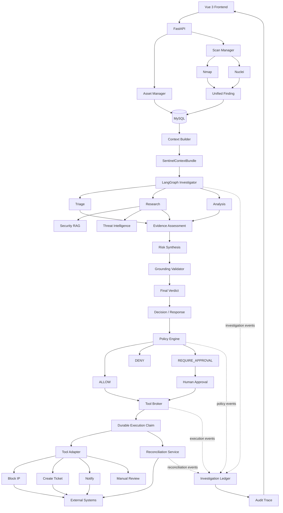

# SentinelAgent

> **AI-Powered Security Operations Agent**
>
> 从自动化安全扫描到证据驱动调查，再到策略约束下的安全响应。

SentinelAgent 是一个面向安全运营场景设计的 AI Security Agent 项目。

它将 **Nmap / Nuclei 自动化安全扫描、结构化安全上下文、LangGraph 多阶段调查、RAG、Threat Intelligence、Evidence Grounding、Policy Engine、Human Approval、Tool Broker、Idempotency、Crash Recovery 与 Audit Trace** 组合成一条完整的安全分析与响应链路。

SentinelAgent 的目标并不是简单地：

```text
Scanner → LLM → Answer
```

而是构建：

```text
Detection
    ↓
Structured Security Context
    ↓
AI Investigation
    ↓
Evidence Grounding
    ↓
Risk Decision
    ↓
Policy Governance
    ↓
Human Approval
    ↓
Controlled Tool Execution
    ↓
Audit / Recovery
```

使 AI 在安全运营场景中的分析与执行更加：

- Structured
- Grounded
- Governed
- Auditable
- Recoverable

---

# 1. Why SentinelAgent?

传统的 AI + 漏洞扫描 Demo 通常采用类似流程：

```text
Nuclei / Scanner Output
        ↓
      Prompt
        ↓
       LLM
        ↓
    Security Report
```

这种方式虽然能够生成安全分析结果，但存在一些明显问题：

- Scanner 原始结果缺少统一上下文；
- LLM 输出与真实证据之间缺少明确边界；
- 检索知识、扫描事实和模型推断容易混在一起；
- Agent 可能直接执行具有副作用的外部操作；
- 重试可能导致 Ticket、通知、封禁等动作重复执行；
- 服务崩溃后难以判断外部动作到底有没有成功；
- 整个调查过程缺少完整的审计链路。

SentinelAgent 将这条流程重新设计为：

```text
Scanner Output
    ↓
Unified Finding
    ↓
Context Builder
    ↓
SentinelContextBundle
    ↓
LangGraph Investigator
    ↓
Triage
    ↓
Research / RAG / Threat Intelligence
    ↓
Analysis
    ↓
Evidence Assessment
    ↓
Risk Synthesis
    ↓
Grounding Validator
    ↓
Final Verdict
    ↓
Decision / Response
    ↓
Policy Engine
    ↓
ALLOW / DENY / REQUIRE_APPROVAL
    ↓
Human Approval
    ↓
Tool Broker
    ↓
Controlled External Execution
    ↓
Investigation Ledger / Audit Trace
```

SentinelAgent 不只是生成一个安全结论，而是尝试构建一个：

> **从安全发现、AI 调查、证据验证，到策略治理和受控响应的完整 Agent Workflow。**

---

# 2. Architecture



从整体设计上，可以把 SentinelAgent 分成三个主要平面。

### Detection Plane

负责资产、安全扫描以及 Finding 标准化：

```text
Asset Manager
Scan Manager
Nmap
Nuclei
Finding
MySQL
```

### Investigation Plane

负责 AI 调查、知识检索、证据评估和最终判断：

```text
Context Builder
SentinelContextBundle
LangGraph Investigator
Triage
Research
RAG
Threat Intelligence
Evidence Assessment
Risk Synthesis
Grounding Validator
Final Verdict
```

### Response Plane

负责策略决策、人类审批、安全工具执行以及执行恢复：

```text
Decision / Response
Policy Engine
Human Approval
Tool Broker
Execution Claim
Tool Adapter
Reconciliation
Investigation Ledger
Audit Trace
```

---

# 3. Core Workflow

一次完整的 SentinelAgent 调查大致经过以下流程：

```text
1. Asset Discovery

        ↓

2. Nmap Port / Service Discovery

        ↓

3. Nuclei Security Scan

        ↓

4. Normalize Result into Finding

        ↓

5. Persist Finding into MySQL

        ↓

6. Context Builder

        ↓

7. SentinelContextBundle

        ↓

8. LangGraph Investigation

        ↓

9. Triage

        ↓

10. Research
    ├── Security RAG
    └── Threat Intelligence

        ↓

11. Analysis

        ↓

12. Evidence Assessment

        ↓

13. Risk Synthesis

        ↓

14. Grounding Validation

        ↓

15. Final Verdict

        ↓

16. Response Planning

        ↓

17. Policy Engine

        ↓

18. ALLOW / DENY / REQUIRE_APPROVAL

        ↓

19. Human Approval

        ↓

20. Tool Broker

        ↓

21. Controlled Tool Execution

        ↓

22. Investigation Ledger / Audit Trace
```

---

# 4. Key Features

- **中英文界面切换 / Chinese and English UI**：Settings 支持简体中文 / English，语言偏好在刷新后保持，主要页面、Element Plus 控件和浏览器标题同步切换。

## 4.1 Automated Security Discovery

SentinelAgent 集成：

- Nmap
- Nuclei

实现从目标资产到端口、服务以及 Web 安全发现的自动化扫描链路。

扫描结果不会直接作为最终 AI 输入，而是先转化为统一的 `Finding` 数据结构。

---

## 4.2 Unified Finding Model

不同扫描器产生的数据格式不同。

SentinelAgent 使用统一 Finding 模型组织安全发现，包括：

```text
source
finding_type
title
severity
target
description
evidence
remediation
status
risk_score
risk_level
risk_reason
```

这样后续 Agent Workflow 不需要直接依赖某一个具体扫描器的数据格式。

---

# 5. Security Context Engineering

SentinelAgent 没有直接：

```text
Finding → Prompt → LLM
```

而是增加：

```text
Finding
   ↓
Context Builder
   ↓
SentinelContextBundle
   ↓
Investigator
```

Context Builder 负责把调查相关的信息组织成结构化上下文，使模型能够区分：

- Asset Context
- Scanner Evidence
- Finding Information
- Research Results
- RAG Knowledge
- Threat Intelligence
- Investigation History

这使后续 Agent 节点之间可以共享统一的安全调查上下文。

---

# 6. LangGraph Investigator

SentinelAgent 使用 LangGraph 构建多阶段安全调查流程。

核心节点包括：

```text
Triage
   ↓
Research
   ↓
Analysis
   ↓
Evidence Assessment
   ↓
Risk Synthesis
   ↓
Grounding Validator
   ↓
Final Verdict
```

与单次 Prompt 相比，这种设计能够把不同推理职责拆分到不同节点中，使调查过程更容易：

- 调试；
- 评测；
- 追踪；
- 扩展；
- 审计。

---

# 7. Security RAG

Research 阶段可以结合安全知识库进行 RAG 检索。

基本流程：

```text
Security Finding
       ↓
Query Construction
       ↓
Vector Retrieval
       ↓
Security Knowledge
       ↓
Research Context
       ↓
Investigation
```

项目同时包含针对 RAG 的评测与 ablation 实验，用于分析不同检索配置对最终调查结果的影响。

目标并不是单纯“接入向量数据库”，而是验证：

```text
Retrieved Context
        ↓
Does it actually improve
security investigation?
```

---

# 8. Threat Intelligence

Research 阶段也可以结合 Threat Intelligence，为调查过程提供额外安全情报。

RAG 与 Threat Intelligence 的定位不同：

```text
RAG
↓
内部 / 垂直安全知识

Threat Intelligence
↓
外部安全情报
```

它们共同作为 Evidence Assessment 的输入，而不是直接决定最终结论。

---

# 9. Evidence Assessment

SentinelAgent 将：

```text
Evidence
```

与：

```text
Model Reasoning
```

尽量分离。

Evidence Assessment 对调查阶段产生的证据进行整理和判断，为后续风险分析提供基础。

核心思想是：

> AI 可以进行推理，但最终安全判断应该尽可能能够回到具体证据。

---

# 10. Risk Synthesis

Evidence Assessment 之后进入 Risk Synthesis。

该阶段结合：

- Finding severity
- Scanner evidence
- Research evidence
- Threat intelligence
- Analysis result
- Evidence confidence

形成结构化风险判断。

---

# 11. Grounding Validator

Grounding Validator 是 SentinelAgent 中非常重要的一层。

它用于检查最终安全结论是否能够被当前上下文和证据支持。

因此整个调查流程不是：

```text
LLM says vulnerable
        ↓
Accept
```

而是：

```text
LLM Analysis
     ↓
Evidence Assessment
     ↓
Risk Synthesis
     ↓
Grounding Validation
     ↓
Final Verdict
```

这一设计主要用于降低安全 Agent 中：

- hallucination；
- unsupported claim；
- evidence mismatch；

对最终结果的影响。

---

# 12. Final Verdict

完成风险综合与 Grounding Validation 后，Investigator 输出最终调查结论。

Final Verdict 不直接执行安全操作。

它首先进入：

```text
Decision / Response
        ↓
Policy Engine
```

---

# 13. Policy Engine

SentinelAgent 不允许 LLM 自由决定是否执行外部工具。

Response Plan 必须经过 Policy Engine。

Policy Engine 可以产生：

```text
ALLOW
DENY
REQUIRE_APPROVAL
```

### ALLOW

允许进入 Tool Broker。

### DENY

拒绝执行。

### REQUIRE_APPROVAL

必须经过 Human Approval。

这种设计使：

```text
AI reasoning
```

与：

```text
execution authorization
```

保持分离。

---

# 14. Human Approval

对于需要人工确认的操作：

```text
REQUIRE_APPROVAL
        ↓
Human Approval
        ↓
Approved / Rejected
```

只有通过审批的操作才可以继续进入 Tool Broker。

因此：

> LLM 的建议本身不等于执行权限。

---

# 15. Tool Broker

Tool Broker 是 SentinelAgent Response Plane 的核心执行组件。

它负责统一处理 Agent 工具调用。

目前的 Adapter 体系包括：

```text
Create Ticket
Block IP
Notify
Manual Review
```

工具通过统一 Registry 与 Adapter 接口注册。

Tool Broker 负责：

```text
Authorization
    ↓
Parameter Validation
    ↓
Execution Intent
    ↓
Durable Claim
    ↓
Adapter Invocation
    ↓
Execution Result
    ↓
Ledger Record
```

---

# 16. Safe External Execution

安全 Agent 一旦开始执行外部操作，会遇到一个非常重要的问题：

> 如果外部操作已经成功，但服务在保存本地状态之前崩溃了怎么办？

例如：

```text
SentinelAgent
     ↓
Create GitHub Issue
     ↓
GitHub successfully creates Issue
     ↓
Backend crashes
     ↓
Local database never records success
```

服务恢复后如果直接 retry：

```text
Retry
  ↓
Create another Issue
```

就会产生重复外部副作用。

因此 SentinelAgent 在 Tool Broker 中加入了：

- Execution Intent
- Durable Execution Claim
- Request Fingerprint
- Idempotency Key
- Execution ID
- Replay
- External Duplicate Suppression
- Crash Recovery
- Reconciliation

---

# 17. Durable Execution Claim

执行外部工具之前，SentinelAgent 会首先创建 Durable Execution Claim。

Claim 用于持久化：

```text
run_id
request_index
tool_name
idempotency_key
request_fingerprint
execution_id
status
attempt
owner_token
receipt
output
```

这样，即使进程崩溃，数据库仍然保留此次外部执行的身份信息。

---

# 18. Idempotency & Replay

对于已经完成的相同执行请求：

```text
Same Request
     ↓
Existing Completed Claim
     ↓
Replay Stored Result
```

而不是：

```text
Same Request
     ↓
Invoke External Tool Again
```

这用于减少重复：

- Ticket；
- Notification；
- External API side effects。

---

# 19. Crash Recovery & Reconciliation

SentinelAgent 实现了针对 uncertain execution 的 Reconciliation Workflow。

典型场景：

```text
Acquire Execution Claim
        ↓
Invoke External System
        ↓
External Side Effect Succeeds
        ↓
Backend Crashes
        ↓
Claim Remains "claimed"
        ↓
Claim Becomes Stale
        ↓
Reconciliation Service
        ↓
Check External State
```

如果外部系统能够确认此次执行已经成功：

```text
confirmed_completed
        ↓
Atomic Local Recovery
        ↓
Claim → completed
        ↓
Future Request → replay
```

如果外部系统无法确认：

```text
not_found
unsupported
unknown
```

SentinelAgent 不会简单地重新执行危险外部动作。

核心原则：

```text
not_found != not_executed
```

也就是说：

> “没有查到”不代表“之前一定没有执行”。

因此未知状态默认采用 fail-closed 策略。

---

# 20. Reconciliation Safety

Reconciliation Service 使用独立的 reconciliation ownership 和 fencing 机制。

目标是避免：

```text
Worker A
    +
Worker B
```

同时恢复同一个 stale execution。

Reconciliation 过程不会调用：

```text
adapter.execute()
```

而是调用：

```text
adapter.reconcile()
```

从而把：

```text
Execute
```

与：

```text
Verify External State
```

明确分离。

---

# 21. GitHub Ticket Adapter

Create Ticket Adapter 支持 GitHub Issues。

默认开发环境可以使用 dry-run。

启用真实 GitHub execution 时，需要显式配置：

```text
SENTINEL_EXTERNAL_TOOL_EXECUTION_ENABLED=true
SENTINEL_GITHUB_TICKET_ENABLED=true
SENTINEL_GITHUB_OWNER=<owner>
SENTINEL_GITHUB_REPO=<repo>
SENTINEL_GITHUB_TOKEN=<token>
```

GitHub Ticket Adapter 使用 `execution_id` 关联外部 Issue。

Reconciliation 时：

```text
execution_id
     ↓
Search Existing GitHub Issue
     ↓
Found
     ↓
confirmed_completed
```

Reconciliation 本身不会创建新的 Issue。

真实外部执行默认关闭，需要显式开启。

---

# 22. Investigation Ledger

SentinelAgent 将关键调查与执行过程记录到 Investigation Ledger。

记录内容包括：

```text
Investigation Events
Policy Events
Approval Events
Tool Execution Events
Reconciliation Events
Failure Events
```

每个事件可以包含：

```text
run_id
event_type
node_name
status
summary
event_metadata
created_at
```

---

# 23. Audit Trace

前端 Audit Center 可以查看 Investigation Trace。

用于回答：

```text
What happened?

Why did the Agent make this decision?

Which node produced this result?

Was external execution allowed?

Was human approval required?

Did the Tool Broker invoke the adapter?

Was the result replayed?

Did reconciliation recover a stale execution?
```

Reconciliation 相关事件包括：

```text
tool_reconciliation_started
tool_reconciliation_confirmed
tool_reconciliation_unresolved
tool_reconciliation_failed
```

这使整个 Agent Workflow 可以被追踪和审计。

---

# 24. Evaluation

SentinelAgent 不只实现 Agent Workflow，也包含针对不同模块的 Evaluation。

项目目前覆盖的评测方向包括：

```text
Prompt Evaluation
Dataset Validation
RAG Evaluation
RAG Top-K Ablation
Tool Registry
Tool Capability
Tool Adapter
Tool Broker
Broker Integration
Real-mode Execution Guard
Execution Idempotency
Execution Claim
Claim Staleness
Ticket Reconciliation
Reconciliation Service
```

例如：

```powershell
python -m app.evaluation.reconciliation_service_evaluator
python -m app.evaluation.execution_claim_evaluator
python -m app.evaluation.claim_staleness_evaluator
python -m app.evaluation.ticket_reconciliation_evaluator
python -m app.evaluation.execution_idempotency_evaluator
python -m app.evaluation.tool_broker_evaluator
python -m app.evaluation.tool_broker_integration_evaluator
python -m app.evaluation.broker_real_mode_evaluator
```

Evaluation 的目标是让 Prompt、RAG、Agent Workflow 和 Tool Execution 不只“看起来能运行”，而是能够被重复验证。

---

# 25. Tech Stack

## Frontend

```text
Vue 3
Vite
Element Plus
Axios
```

## Backend

```text
Python
FastAPI
Pydantic
SQLAlchemy
```

## Database

```text
MySQL
```

## Security

```text
Nmap
Nuclei
```

## AI / Agent

```text
Ollama
LangGraph
RAG
Embedding Model
Threat Intelligence
```

## Engineering

```text
Structured Context
Prompt Evaluation
RAG Evaluation
Idempotency
CAS / Fencing
Crash Recovery
Reconciliation
Audit Logging
```

---

# 26. Project Structure

下面仅展示核心目录。

```text
SentinelAgent/
│
├── backend/
│   │
│   ├── app/
│   │   ├── agent/
│   │   │   ├── adapters/
│   │   │   ├── execution_claims.py
│   │   │   ├── reconciliation_service.py
│   │   │   └── ...
│   │   │
│   │   ├── api/
│   │   ├── core/
│   │   ├── db/
│   │   ├── evaluation/
│   │   ├── models/
│   │   ├── scanners/
│   │   ├── schemas/
│   │   └── main.py
│   │
│   ├── evals/
│   ├── scripts/
│   │   └── migrate_schema.py
│   │
│   ├── .env.example
│   └── ...
│
├── frontend/
│   │
│   ├── src/
│   │   ├── api/
│   │   ├── components/
│   │   ├── router/
│   │   ├── views/
│   │   ├── App.vue
│   │   └── main.js
│   │
│   ├── package.json
│   └── ...
│
├── docs/
│   └── DEMO.md
│
├── .gitignore
└── README.md
```

---

# 27. Requirements

建议开发环境准备：

```text
Python 3.12+
Node.js / npm
MySQL
Nmap
Nuclei
Nuclei Templates
Ollama
```

同时需要至少一个可用的本地 LLM 和 Embedding Model。

具体模型可以根据本地硬件环境调整。

---

# 28. Quick Start

## 28.1 Clone

```bash
git clone <your-repository-url>
cd SentinelAgent
```

---

## 28.2 Backend Environment

进入后端：

```powershell
cd backend
```

创建并激活 Python virtual environment：

```powershell
python -m venv .venv
.\.venv\Scripts\Activate.ps1
```

安装项目所需 Python 依赖。

然后根据：

```text
backend/.env.example
```

配置本地：

```text
backend/.env
```

注意：

> 不要将 `.env`、Token、密码或其他 Secret 提交到 Git。

---

## 28.3 Database Migration

运行：

```powershell
python -m scripts.migrate_schema
```

Migration 可以重复执行。

---

## 28.4 Start Backend

```powershell
uvicorn app.main:app --reload --host 127.0.0.1 --port 18080
```

FastAPI Swagger：

```text
http://127.0.0.1:18080/docs
```

---

## 28.5 Start Frontend

打开新的终端：

```powershell
cd frontend
npm install
npm run dev
```

然后通过 Vite 输出的本地地址访问 SentinelAgent。

---

## 28.6 Build Frontend

```powershell
npm run build
```

---

# 29. Demo Flow

推荐按照以下顺序演示项目：

```text
Asset
   ↓
Scan
   ↓
Nmap / Nuclei
   ↓
Finding
   ↓
Investigation
   ↓
Triage
   ↓
Research
   ↓
Evidence Assessment
   ↓
Risk Synthesis
   ↓
Grounding Validator
   ↓
Final Verdict
   ↓
Policy
   ↓
Approval
   ↓
Tool Broker
   ↓
Audit Center
```

然后单独展示：

```text
Crash Recovery / Reconciliation
```

从而体现 SentinelAgent 不只是一个 AI 分析 Demo，还考虑了真实 Agent 执行中的可靠性问题。

详细演示流程参见：

```text
docs/DEMO.md
```

---

# 30. Security Design Principles

SentinelAgent 在设计时遵循以下原则。

## AI does not equal authorization

模型可以提供建议，但不能天然获得执行权限。

---

## Default to safe execution

具有真实外部副作用的操作默认关闭或使用 dry-run。

---

## Human-in-the-loop

高风险动作可以要求人工审批。

---

## Evidence before action

安全结论应尽量能够回到扫描证据、检索证据和调查上下文。

---

## Fail closed on uncertain side effects

外部操作结果不确定时，不直接重试。

---

## Idempotency before retry

任何具有外部副作用的重试都需要考虑幂等问题。

---

## Reconcile before re-execute

对于 stale / uncertain execution：

```text
Verify External State First
```

而不是：

```text
Execute Again First
```

---

## Audit everything important

调查、策略决策、审批、执行和恢复过程都应该留下可审计事件。

---

# 31. Current Project Status

目前已经完成：

- [x] Vue 3 Frontend
- [x] Frontend i18n — 简体中文 / English
- [x] FastAPI Backend
- [x] MySQL Persistence
- [x] Asset Management
- [x] Scan Management
- [x] Nmap Integration
- [x] Nuclei Integration
- [x] Unified Finding
- [x] Context Builder
- [x] SentinelContextBundle
- [x] LangGraph Investigator
- [x] Triage
- [x] Research
- [x] Analysis
- [x] Security RAG
- [x] RAG Evaluation
- [x] RAG Ablation
- [x] Threat Intelligence
- [x] Evidence Assessment
- [x] Risk Synthesis
- [x] Grounding Validator
- [x] Final Verdict
- [x] Decision / Response
- [x] Policy Engine
- [x] ALLOW / DENY / REQUIRE_APPROVAL
- [x] Human Approval
- [x] Tool Registry
- [x] Tool Adapter Architecture
- [x] Tool Broker
- [x] Durable Execution Claim
- [x] Idempotency
- [x] Replay
- [x] External Duplicate Suppression
- [x] Crash Recovery
- [x] Reconciliation Service
- [x] Investigation Ledger
- [x] Audit Trace
- [x] Reconciliation API
- [x] Audit Center Reconciliation UI
- [x] Schema Migration Script
- [x] Demo Runbook

---

# 32. Roadmap

下一阶段计划包括：

- [ ] Additional SOAR integrations
- [ ] Additional Threat Intelligence providers
- [ ] More governed response adapters
- [ ] Multi-user authentication and RBAC
- [ ] Production-grade database migration framework
- [ ] More comprehensive benchmark datasets
- [ ] End-to-end production deployment
- [ ] Observability / metrics
- [ ] Additional external execution reconciliation providers

---

# 33. SentinelAgent vs Traditional Scanner

传统扫描器更关注：

```text
What vulnerability exists?
```

SentinelAgent 尝试继续回答：

```text
What happened?

What evidence supports it?

How risky is it?

What information is still missing?

What should we do?

Is the action allowed?

Does it require human approval?

Has the action already been executed?

Can the result be safely replayed?

What happens if execution crashes?

Can the entire process be audited?
```

因此 SentinelAgent 更接近：

```text
Security Detection
        +
AI Investigation
        +
Decision Governance
        +
Controlled Response
        +
Execution Reliability
```

而不仅仅是：

```text
Vulnerability Scanner + LLM
```

---

# 34. Project Highlights

SentinelAgent 的主要工程亮点包括：

### 1. Structured Security Context

通过 `Context Builder + SentinelContextBundle`，避免直接把原始扫描结果丢给模型。

### 2. Multi-stage Agent Investigation

使用 LangGraph 将复杂安全调查拆分为多个职责明确的节点。

### 3. RAG + Evaluation

不仅接入 Security RAG，还对检索效果进行独立 Evaluation 与 Ablation。

### 4. Evidence Grounding

通过 Evidence Assessment、Risk Synthesis 和 Grounding Validator 降低 unsupported conclusions。

### 5. Governed Agent Execution

使用 Policy Engine + Human Approval + Tool Broker 分离：

```text
Reasoning
Authorization
Execution
```

### 6. Crash-safe External Side Effects

针对真实 Agent 中最容易被忽略的外部副作用问题，实现：

```text
Durable Claim
Idempotency
Replay
Fencing
Reconciliation
Atomic Recovery
```

### 7. Full Auditability

通过 Investigation Ledger 和 Audit Trace 记录 AI Agent 调查、决策与执行过程。

---

# 35. Interview Summary

如果用一句话描述 SentinelAgent：

> **SentinelAgent 将传统漏洞扫描结果转化为结构化安全上下文，通过多阶段 AI Agent 完成证据驱动的安全调查，并通过 Policy Engine、Human Approval 与具备幂等和崩溃恢复能力的 Tool Broker 实现受控安全响应。**

如果用英文描述：

> **SentinelAgent transforms raw security findings into structured investigation context, performs evidence-grounded multi-stage AI investigation, and executes response actions through policy-governed, auditable, and crash-safe tooling.**

---

# 36. Disclaimer

SentinelAgent is intended for:

- security research;
- defensive security;
- authorized vulnerability assessment;
- AI security engineering experiments.

Only scan or interact with systems for which you have explicit authorization.

Do not use this project for unauthorized access or attacks against third-party systems.

---

# 37. License

A license can be added according to the intended release model of the project.

For example:

```text
MIT License
Apache License 2.0
```

Choose the final license before public release.

---

# SentinelAgent

```text
Detect
  ↓
Understand
  ↓
Investigate
  ↓
Ground
  ↓
Decide
  ↓
Govern
  ↓
Execute
  ↓
Recover
  ↓
Audit
```

**AI-powered security investigation should not only be intelligent — it should also be grounded, governed, recoverable, and auditable.**